# Defining triggers 
Each dialog in the Bot Framework Composer includes a set of triggers (event handlers) that contain actions (instructions) for how the bot will respond to inputs received when the dialog is active. There are several different types of triggers in Composer. They all work in a similar manner and can even be interchanged in some cases. This article explains how to define each type of trigger. Before you walk through this article, please read the [events and triggers](concept-events-and-triggers.md) concept article. 

The table below lists the six different types of triggers in Composer and their descriptions. 

| Trigger Type      | Description                                                                                 |
| ----------------- | ------------------------------------------------------------------------------------------- |
| [Intent recognized](#intent-recognized) | Executes when an `intent` is recognized.                              |
| [Unknown intent](#Unknown-intent)       | Executes when no intent is recognized.                                |
| [Dialog events](#Dialog-events)         | Executes when a dialog event such as **BeginDialog** occurs.          |
| [Activities](h#Activities)    | Executes when an activity event occurs, such as when a new conversation starts. |
| [Message events](#message-events)       | Executes when a message is updated, deleted or reacted to.            |
| [Custom event](#custom-event)           | Executes when a custom event occurs.                                  |

## Intent recognized
This trigger type is used to define the actions to execute when an [intent](concept-language-understanding.md#intents) is found in a message sent from the user. The **Intent recognized** trigger works in conjunction with **recognizers**. There are two **recognizers** in Composer, one for [LUIS](#luis-recognizer) and the other for [Regular Expression](#regular-expression-recognizer). You define which recognizer is used, if any, at the dialog level and all triggers in a dialog will use the same type of recognizer. 

To create the **Intent recognized** trigger, select **New Trigger** in the navigation pane then **Intent recognized** from the drop-down list. You will see the intent trigger menu as follows: 

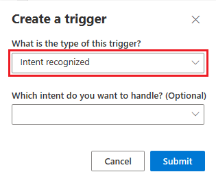

If you have not defined any intents the **Which intent do you want to handle?** drop-down list will show "_No intents configured for this dialog_" and there will be no intent to configure, however you can define an intent later in the triggers properties panel located on the left side of the Composer screen.

Once the **Intent recognized** trigger has been created, you can further refine it by assigning one or more [entities](concept-language-understanding.md#entities) in the properties panel. 

> [!TIP]
> You need to press the **Enter** key after entering an entity or it will not be saved.

It is also possible to add a **condition** to the trigger.  A condition is an expression that follows [Common Language Expression](https://github.com/microsoft/BotBuilder-Samples/tree/master/experimental/common-expression-language) syntax. If a condition is specified, it must evaluate to  "true" for the event to fire.

 The basic steps to define an **Intent recognized** trigger are as follows:

1. Set up a [recognizer](./concept-dialog.md#recognizer) type in your dialog.
2. Define [intents](concept-language-understanding.md#intents) in the Language Understanding editor.
3. Create an **Intent recognized** trigger to handle each intent you created (one trigger per intent).
4. Define [activities](#activities) in the trigger.

### LUIS recognizer 
[LUIS](https://www.luis.ai/home) is a machine learning-based service you can use to build natural language capabilities into your bot. Using a LUIS recognizer enables you to extract intents and entities based on a LUIS application, which you can train in advance.

Composer enables developers to create language training data in the dialog authoring canvas because it is deeply integrated with the [LUIS](https://www.luis.ai/home) API. LUIS is able to take natural language input from users and translate it into a named intent and a set of extracted entity values the message contains. 

### Create an Intent recognized trigger
Follow the steps to define an **Intent recognized** trigger with a LUIS recognizer:

1. In the properties panel of your selected dialog, choose **LUIS** as recognizer type.

    

2. In the Language Understanding editor, create intents with sample [utterances](concept-language-understanding.md#utterances) following the [.lu file format](https://github.com/Microsoft/botbuilder-tools/blob/master/packages/Ludown/docs/lu-file-format.md#lu-file-format). 

    Below is a screenshot showing the **text editor** in a dialogs properties panel. This example captures two simple _intents_ ("Greeting" and "BookFlight") each with a list of example _utterances_ that capture ways users might express these two intents. You can use - or + or * to denote lists. Numbered lists are not supported.

    

    >[!NOTE]
    > Each intent contains a series of sample utterances which will be used as training data in LUIS to recognize any pre-defined intent. 
    
    > [IIMPORTANT]
    > You will need a [LUIS authoring key](https://aka.ms/bot-framework-emulator-LUIS-keys?tabs=V2#programmatic-key) to get your training data published. For details, read [using LUIS for language understanding](howto-using-LUIS.md) article. 

3. Select **Intent recognized** from the trigger menu and pick the intent you want the trigger to handle. Each **Intent** trigger handles one intent. 

    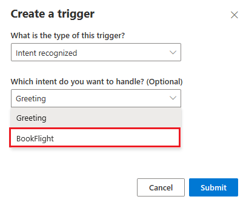 

4. Optionally, you can set the **Condition** property to avoid low confidence results given that LUIS is a machine learning based intent classifier. For example, set the **Condition** property to this in the **Greeting** intent: 

    `#Greeting.Score >=0.8` 

    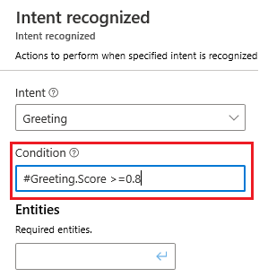

This definition means that the **Greeting** intent trigger will only fire when the confidence score returned by LUIS is equal to or greater than 0.8. 

### Regular expression recognizer 
A [regular expression](https://regexr.com/) is a special text string for describing a search pattern that can be used to match simple or sophisticated patterns in a string. Composer exposes the ability to define intents using regular expressions and also allows regular expressions to extract simple entity values. While LUIS offers the flexibility of a more fully featured language understanding technology, the [regular expression recognizer](https://github.com/microsoft/BotBuilder-Samples/blob/master/experimental/adaptive-dialog/docs/recognizers-rules-steps-reference.md#regex-recognizer) works well when you need to match a narrow set of highly structured commands or keywords. 

In the example below, a similar book-flight intent is defined. However, this will _only_ match the very narrow pattern "book flight to [somewhere]", whereas the LUIS recognizer will be able match a much wider variety of messages. 

Follow the steps to define **Intent recognized** trigger with [Regular Expressions](https://regexr.com/) recognizer: 

1. In the properties panel of your selected dialog, choose **Regular Expression** as recognizer type for your dialog. 

    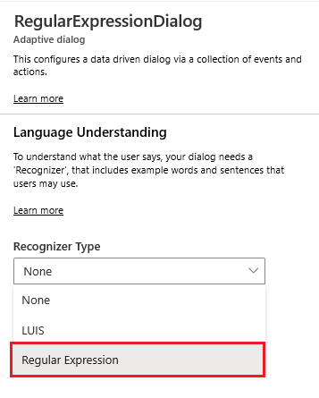

2. In the **regular expression editor**, create a regular expression **intent** and **pattern** as shown in the screenshot below: 

    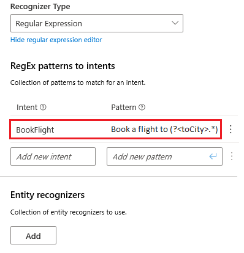

    <!-- OPEN ISSUE: This is not clear... is the string "book a flight to" part of the RegEx? What is the parenthesis around the "?<city>.*" for?  What are the angle brackets for? What does the "?<city>.*" do?  While it is not our job to teach RegEx, we should explain the sample  -->

> [!NOTE]
> Create an **Intent recognized** trigger to handle each intent you define as instructed in the [LUIS recognizer](how-to-define-triggers.md#LUIS-recognizer) section. 

## Unknown intent 
This is a trigger type used to define actions to take when there is no **Intent recognized** trigger to handle an existing intent. 

Follow the steps to define an **Unknown intent** trigger:

1. In the navigation pane, select **New Trigger**.

2. Select **Create a Trigger** from the **What is the type of this trigger?** drop-down list, then **Submit**. 

    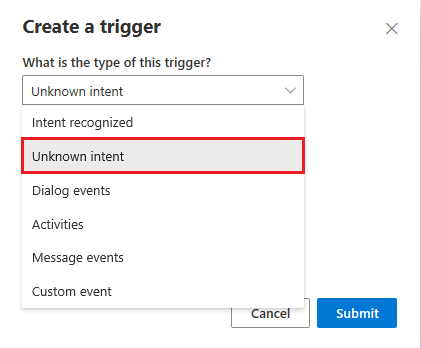

2. After you select **Submit**, you will see an empty **Unknown intent** trigger in the authoring canvas. 

3. Select the **+** sign under the trigger node to add any action node(s) you want to include. For example, you can select **Send a response** to send a message "This is an unknown intent trigger!". When this trigger is fired, the response message will be sent to the user. 

      

<!--  OPEN ISSUE: "Dialog events" or Dialog trigger"?  Why not stick to a consistent terminology?  It basically says that a dialog event "is a trigger type use to define..." -->

## Dialog events
This is a trigger type used to define actions to take when a dialog event such as `BeginDialog` is fired. Most dialogs will include an event handler (trigger) configured to respond to the `BeginDialog` event, which fires when the dialog begins and allows the bot to respond immediately. Follow the steps below to define a **Dialog started** trigger: 

1. Select **New Trigger** in the navigation pane then select **Dialog events** from the drop-down list.

    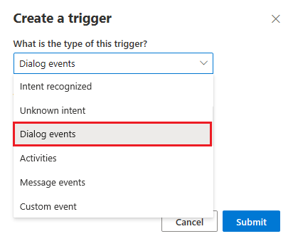

2. Select **Dialog started (Begin dialog event)** from the **Which event?** drop-down list then select **Submit**. 

    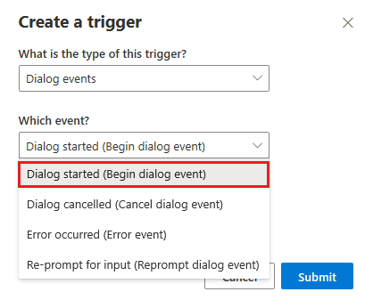

3. Select the **+** sign under the *Dialog started* node and then select **Begin a new dialog** from the **Dialog management** menu. 

    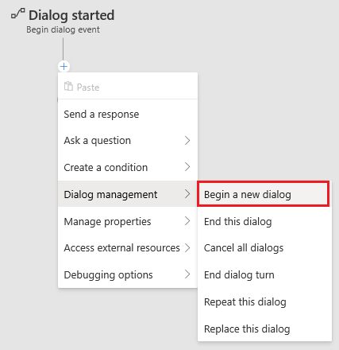

4. Before you can use this trigger you must associate a dialog to it. You do this by selecting a dialog from the **Dialog name** drop-down list in the **properties panel** on the right side of the Composer window. You can select an existing dialog or create a new one.  the example below demonstrates selecting and existing dialog named *weather*. 

     
    <!-- -->

    <!--  OPEN ISSUE: Why not explain the next steps are? See additions to step 4 above.  -->
    

## Activities
This type of trigger is used to handle activity events such as your bot receiving a `ConversationUpdate` Activity. This indicates a new conversation began and you use a **Greeting (ConversationUpdate activity)** trigger to handle it. 

The following steps demonstrate hot to create a **Greeting (ConversationUpdate activity)** trigger to send a welcome message: 

1. Select **New Trigger** in the navigation pane then **Activities** from the drop-down list.

    

2. Select **Greeting (ConversationUpdate activity)** from the **Which activity type?** drop-down list then select **Submit**. 

    

3. Select the **+** sign under the *ConversationUpdate Activity* node and then select **Send a response**. 

4. Author your response in the **Language Generation** editor in the **properties panel** on the right side of the Composer window, by entering a message following [.lg file format](https://github.com/microsoft/BotBuilder-Samples/blob/master/experimental/language-generation/docs/lg-file-format.md) as demonstrated in the image below. 

    

<!-- OPEN ISSUE: Custom Events are confusing.  If I understand this correctly a 'custom event' consists of 2 separate but related things:

    1. You create a mechanism that fires a custom event.  This is defined as a new trigger.
    2. You create a mechanism that handles a custom event. This seems to be defined as a new action contained in a dialog flow that is
       separate from the trigger in which the mechanism that fires a custom event resides in.  If it is an action, it is not labeled as 
       such in the UI.  The label still shows "Emit a custom event", just as it does in step 1 above.

    My changes to the instructions below will explain that this is a two step process, and I changed the order of creation to create the
    trigger first.

 -->

## Custom events
Creating custom events is a two step process. The first step is to create a new trigger of type *Custom event* that any dialog in your bot can consume. This is your custom event handler that contains the actions associated with this event. The second step is to assign this custom event (trigger) to one or more dialogs. Follow the steps below to create a **Custom event** handler:

### Create a custom event handler
1. Select **New Trigger** in the navigation pane, then select **Custom event** from the drop-down list, then **Submit**.

2. Name your custom event handler "*Weather*" by entering that into the **Custom event name** field in the properties panel on the right side of the Composer window. You will use the custom event name when associating it with any triggers that will invoke it.

    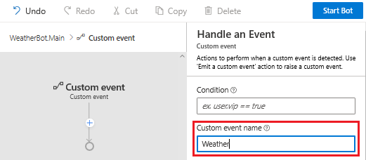

3. Now you can add an action to your custom event handler, this defines what will happen when it is triggered. Do this by selecting the **+** sign and then **Send a response** from the actions menu. Enter the desired response for this action in the Language Generation editor, for this example enter "This is a custom trigger!". 

    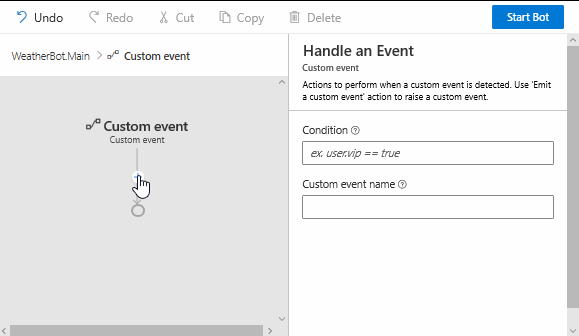

Now you have completed defining your **Custom event** trigger. The next step is to create the **Emit a custom event** activity.

### Emit a custom event
Now that your custom event handler has been created, you can fire (emit) that event from any place in the flow of any dialog in your bot. Follow the steps below to emit your custom event:

1. In the Composer navigation pane select the trigger you want to associate your custom event with. This opens the trigger in the authoring canvas where you can specify exactly where in the flow you want to trigger this event from. Once determined, select the **+** sign and then select **Emit a custom event** from the **Access external resources** drop-down list.

    

2. In the _properties panel_ of this activity, on the right side of the Composer window, enter the name of the _custom event handler_ previously created ("*Weather*") into the **Event name** field, then select **Bubble event**. 

    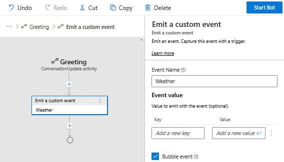

> [!TIP]
> When **Bubble event** is selected, any event that is not handled in the current dialog will _bubble up_ to that dialogs parent dialog where it will continue to look for handlers for the custom event. 

Now you have completed both of the required steps needed to create and execute a custom event. When **Emit a custom event** fires, your custom event handler will handle this event and send the response you defined.

## References
- The [Events and triggers](./concept-events-and-triggers.md) concept article.

## Next 
- Learn how to [control conversation flow](./how-to-control-conversation-flow.md).

